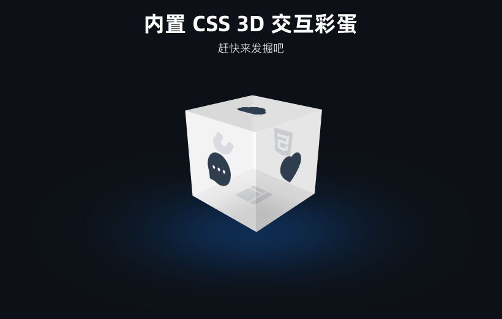

<div align="center">
    
</div>

&nbsp;
## 概况

SOLKA (索尔卡) 是由 Vincent 开发创作的，它是基于 <code>Vite</code> 构建工具、<code>Vue3</code> 和 <code>Javascript</code> 为基础，采用 <code>Pinia</code> 作为状态管理器、<code>Tailwindcss</code> 作为 CSS 框架、<code>AntDesignVue</code> 作为 UI 框架进行的中后台解决方案。

该项目使用了 `script setup` 语法和极少量的第三方库，可以作为项目的起步进行开发。同时也是 `Vue2 JS` 栈为基础的开发人员作为学习、参考的不错选择。


&nbsp;
## 特性

* 最新的技术栈：Vue3 / Vite  
* 最流行的 CSS 框架：Tailwind  
* 最高效简约的 UI 框架：AntdesignVue  
* 最容易上手的语言：Javascript  
* 最简约的模板语法：Pug、Less  
* 数据请求与模拟：内置 Axios 和 Mock 数据解决方案  


&nbsp;
## 预览




&nbsp;
## 在线预览
[在线预览](http://182.44.14.91:88/)

&nbsp;
## 开发环境配置建议

- [VS Code](https://code.visualstudio.com/) + [Volar](https://marketplace.visualstudio.com/items?itemName=Vue.volar)


&nbsp;
## 安装与使用

请确保你的电脑已经安装 [nodejs](https://nodejs.org/)、npm 包管理器 和 [git](https://git-scm.com/) 版本控制器。

1. 获取项目代码
    ```
    git clone https://github.com/vc0754/solka-mgt.v3js.free
    ```

2. 安装项目依赖
    ```
    cd solka-mgt.v3js.free
    npm install
    ```

3. 运行
    ```
    npm run dev
    ```

4. 打包
    ```
    npm run build
    ```


&nbsp;
## 更新日志
[CHANGELOG](https://github.com/vc0754/solka-mgt.v3js.free/blob/main/CHANGELOG.md)

&nbsp;
## 捐赠
如果你觉得该项目对你有帮助，可以承包了我这个重度咖啡依赖者的咖啡以示支持😁！


&nbsp;
## 交流

* [SOLKA MGT 交流 QQ 群](https://qm.qq.com/cgi-bin/qm/qr?k=ljNl_U14a6Sq0Vjlr2_Fji-n5EEIztWb&jump_from=webapi&authKey=TVVH2XINVUf8Ds3IHkdk3UTg+/XwUQbTmhdcUOHtYAQ/RNjU71USLwu8MCVKGpW8)